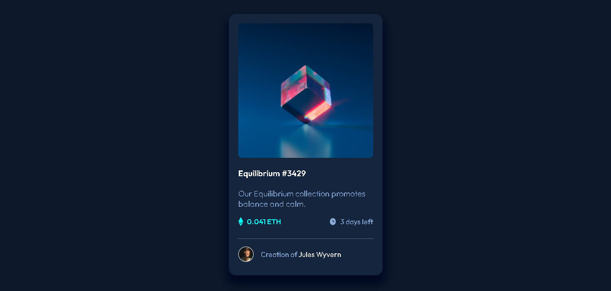

#  NFT CARD PREVIEW

To start this project in your PC you need to have the NPM installed, then, with the files you need to open a integrated terminal and run the command 'npm run start'

## Table of contents

- [Overview](#overview)
  - [The challenge](#the-challenge)
  - [Screenshot](#screenshot)
  - [Links](#links)
- [My process](#my-process)
  - [Built with](#built-with)
- [Author](#author)

## Overview

A solution for a Frontend Mentor challenge, created using React.js and Styled components, where it shows a card with some NFT informations.
### The challenge

Users should be able to:

- View the optimal layout depending on their device's screen size
- See hover states for interactive elements

### Screenshot

### Links

- Live Site URL: [https://nft-card-preview-phi.vercel.app/](https://nft-card-preview-phi.vercel.app/)

## My process

We starting taking the needed libraries, font and colors information, then we created a remote repository, and finally with no problem we created the web app based on an AdobeXD project.
### Built with

- Flexbox
- [React](https://reactjs.org/) - JS library
- [Styled Components](https://styled-components.com/) - For styles

## Author

- LinkedIn - [Jhonatta Silva](https://www.linkedin.com/in/jhonatta-silva-dev/)
